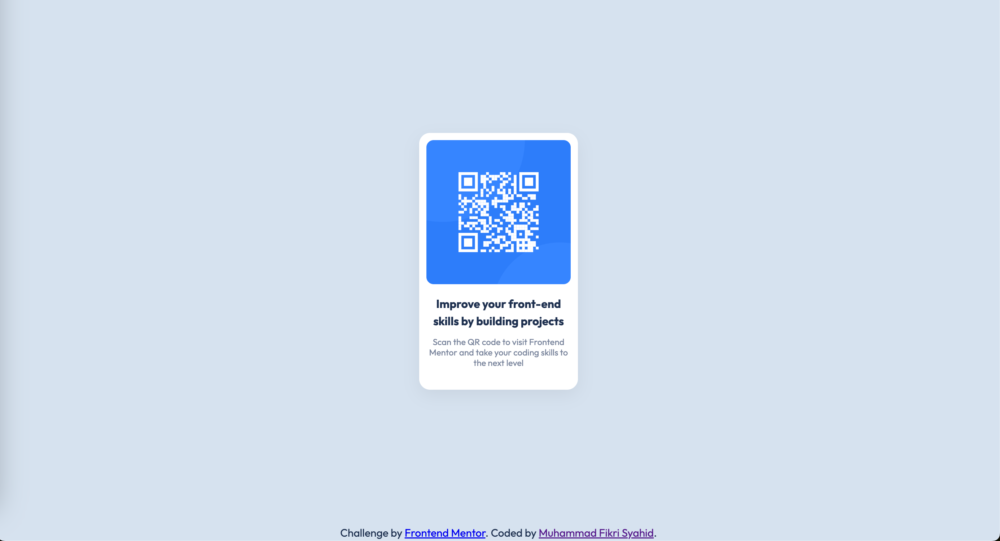

# Frontend Mentor - QR code component solution

This is a solution to the [QR code component challenge on Frontend Mentor](https://www.frontendmentor.io/challenges/qr-code-component-iux_sIO_H). Frontend Mentor challenges help you improve your coding skills by building realistic projects. 

## Table of contents

- [Overview](#overview)
  - [Screenshot](#screenshot)
- [My process](#my-process)
  - [Built with](#built-with)
  - [What I learned](#what-i-learned)
- [Author](#author)

## Overview

### Screenshot

## My process

### Built with

- HTML
- CSS

### Live links
- [Deployment](https://fm-qrcode-lac.vercel.app/)
- [Repository](https://github.com/fikrisyahid/fm-qrcode)

### What I learned

I learned how to use the parent and child css class and how to load font with link. I also discovered that to import a font using link I need to specify the weight on the URL.

## Author

- [Muhammad Fikri Syahid](https://github.com/fikrisyahid)

